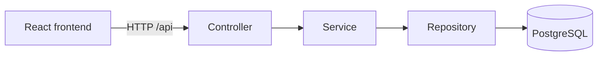

# Service Request Tracker

A full-stack support ticket application built with Spring Boot, React,
PostgreSQL, Docker, and GitHub Actions.

## Overview

Service Request Tracker gives support teams a central place to record and
manage service requests instead of relying on scattered messages or informal
notes. Users can view and filter tickets, submit new requests, inspect ticket
details, and update each ticket's status as work progresses.

The project was built to practise professional full-stack development,
including layered backend design, typed frontend development, database
persistence, validation, containerization, and continuous integration.

## Features

### Frontend

- View and filter tickets
- Create tickets
- View ticket details
- Update ticket status
- Display loading, error, and empty states

### Backend

- RESTful ticket CRUD API
- Status and priority filtering
- Request validation
- Global exception handling
- Consistent API error responses

## Architecture



- **Controller:** handles HTTP requests and responses.
- **Service:** contains application logic.
- **Repository:** accesses PostgreSQL through JPA.
- **DTOs:** separate API data from persistence entities.
- **Exception layer:** converts failures into readable HTTP responses.

## Technology Stack

| Area     | Technologies                                          |
| -------- | ----------------------------------------------------- |
| Backend  | Java 21, Spring Boot, Spring Web MVC, Spring Data JPA |
| Database | PostgreSQL                                            |
| Frontend | React, TypeScript, Vite, Fetch API                    |
| Testing  | JUnit 5, Mockito, MockMvc                             |
| DevOps   | Docker, Docker Compose, GitHub Actions                |

## Local Development

Prerequisites:

- Git
- Docker Desktop
- Docker Compose

Clone the repository and start the complete application:

```bash
git clone https://github.com/nomad-alt/service-request-tracker.git
cd service-request-tracker
docker compose up --build
```

The following services will be available:

| Service     | URL                                 |
| ----------- | ----------------------------------- |
| Frontend    | `http://localhost:3000`             |
| Backend API | `http://localhost:8080/api/tickets` |
| PostgreSQL  | `localhost:5433`                    |

Stop the application with:

```bash
docker compose down
```

This removes the application containers but preserves PostgreSQL data in the
Docker volume.

## API Endpoints

| Method   | Endpoint                   | Description            | Success status   |
| -------- | -------------------------- | ---------------------- | ---------------- |
| `POST`   | `/api/tickets`             | Create a ticket        | `201 Created`    |
| `GET`    | `/api/tickets`             | List all tickets       | `200 OK`         |
| `GET`    | `/api/tickets/{id}`        | Get one ticket         | `200 OK`         |
| `PUT`    | `/api/tickets/{id}`        | Replace ticket details | `200 OK`         |
| `PATCH`  | `/api/tickets/{id}/status` | Update ticket status   | `200 OK`         |
| `DELETE` | `/api/tickets/{id}`        | Delete a ticket        | `204 No Content` |

Tickets can be filtered by status or priority:

```http
GET /api/tickets?status=OPEN
GET /api/tickets?priority=HIGH
```

Status and priority filters cannot currently be combined in a single request.

### Example request

```bash
curl -X POST http://localhost:8080/api/tickets \
  -H "Content-Type: application/json" \
  -d '{
    "title": "Unable to access account",
    "description": "The password reset link has expired.",
    "priority": "HIGH"
  }'
```

Valid priority values:

```text
LOW, MEDIUM, HIGH
```

Valid status values:

```text
OPEN, IN_PROGRESS, CLOSED
```
