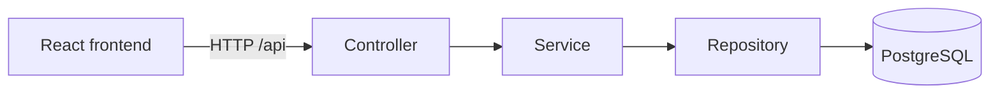

# Service Request Tracker

A full-stack support ticket application built with Spring Boot, React,
PostgreSQL, Docker, and GitHub Actions.

## Overview

Service Request Tracker gives support teams a central place to record and
manage service requests instead of relying on scattered messages or informal
notes. Users can view and filter tickets, submit new requests, inspect ticket
details, and update each ticket's status as work progresses.

The project was built to practise professional full-stack development,
including layered backend design, typed frontend development, database
persistence, validation, containerization, and continuous integration.

## Features

### Frontend

- View and filter tickets
- Create tickets
- View ticket details
- Update ticket status
- Display loading, error, and empty states

### Backend

- RESTful ticket CRUD API
- Status and priority filtering
- Request validation
- Global exception handling
- Consistent API error responses

## Architecture

- **Controller:** handles HTTP requests and responses.
- **Service:** contains application logic.
- **Repository:** accesses PostgreSQL through JPA.
- **DTOs:** separate API data from persistence entities.
- **Exception layer:** converts failures into readable HTTP responses.

## Technology Stack

| Area     | Technologies                                          |
| -------- | ----------------------------------------------------- |
| Backend  | Java 21, Spring Boot, Spring Web MVC, Spring Data JPA |
| Database | PostgreSQL                                            |
| Frontend | React, TypeScript, Vite, Fetch API                    |
| Testing  | JUnit 5, Mockito, MockMvc                             |
| DevOps   | Docker, Docker Compose, GitHub Actions                |
