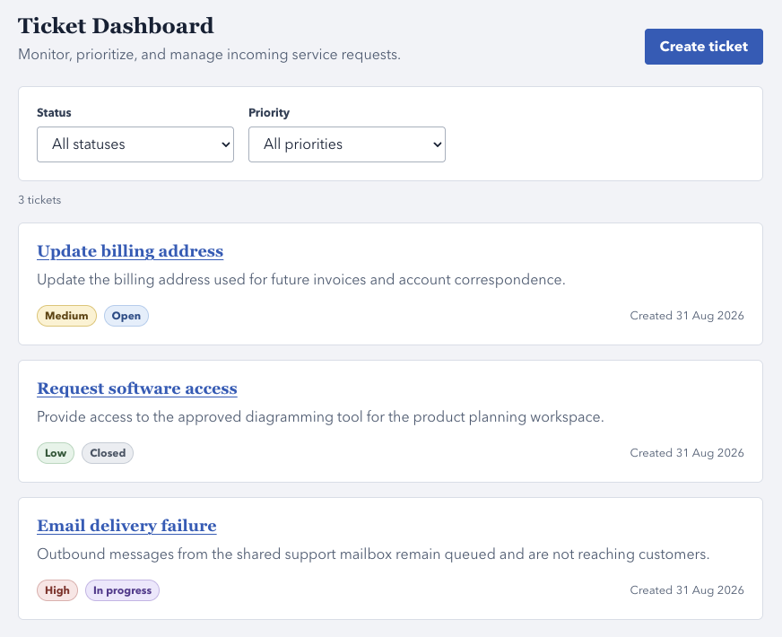
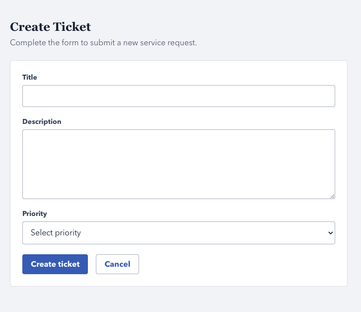
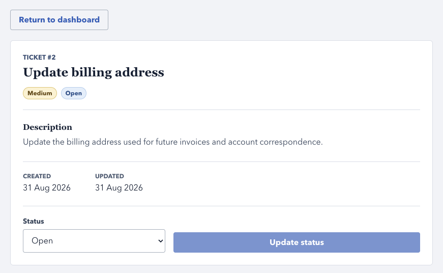
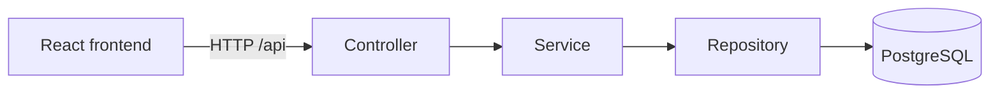

# Service Request Tracker

A full-stack support ticket application built with Spring Boot, React,
PostgreSQL, Docker, and GitHub Actions.

## Overview

Service Request Tracker gives support teams a central place to record and
manage service requests instead of relying on scattered messages or informal
notes. Users can view and filter tickets, submit new requests, inspect ticket
details, and update each ticket's status as work progresses.

The project was built to practise professional full-stack development,
including layered backend design, typed frontend development, database
persistence, validation, containerization, and continuous integration.

## Features

### Frontend

- View and filter tickets
- Create tickets
- View ticket details
- Update ticket status
- Display loading, error, and empty states

### Backend

- RESTful ticket CRUD API
- Status and priority filtering
- Request validation
- Global exception handling
- Consistent API error responses

## Screenshots

### Ticket dashboard



### Create ticket



### Ticket details



## Architecture



- **Controller:** handles HTTP requests and responses.
- **Service:** contains application logic.
- **Repository:** accesses PostgreSQL through JPA.
- **DTOs:** separate API data from persistence entities.
- **Exception layer:** converts failures into readable HTTP responses.

## Technology Stack

| Area     | Technologies                                          |
| -------- | ----------------------------------------------------- |
| Backend  | Java 21, Spring Boot, Spring Web MVC, Spring Data JPA |
| Database | PostgreSQL                                            |
| Frontend | React, TypeScript, Vite, Fetch API                    |
| Testing  | JUnit 5, Mockito, MockMvc                             |
| DevOps   | Docker, Docker Compose, GitHub Actions                |

## Local Development

Prerequisites:

- Git
- Docker Desktop
- Docker Compose

Clone the repository and start the complete application:

```bash
git clone https://github.com/nomad-alt/service-request-tracker.git
cd service-request-tracker
docker compose up --build
```

The following services will be available:

| Service     | URL                                 |
| ----------- | ----------------------------------- |
| Frontend    | `http://localhost:3000`             |
| Backend API | `http://localhost:8080/api/tickets` |
| PostgreSQL  | `localhost:5433`                    |

Stop the application with:

```bash
docker compose down
```

This removes the application containers but preserves PostgreSQL data in the
Docker volume.

## API Endpoints

| Method   | Endpoint                   | Description            | Success status   |
| -------- | -------------------------- | ---------------------- | ---------------- |
| `POST`   | `/api/tickets`             | Create a ticket        | `201 Created`    |
| `GET`    | `/api/tickets`             | List all tickets       | `200 OK`         |
| `GET`    | `/api/tickets/{id}`        | Get one ticket         | `200 OK`         |
| `PUT`    | `/api/tickets/{id}`        | Replace ticket details | `200 OK`         |
| `PATCH`  | `/api/tickets/{id}/status` | Update ticket status   | `200 OK`         |
| `DELETE` | `/api/tickets/{id}`        | Delete a ticket        | `204 No Content` |

Tickets can be filtered by status or priority:

```http
GET /api/tickets?status=OPEN
GET /api/tickets?priority=HIGH
```

Status and priority filters cannot currently be combined in a single request.

### Example request

```bash
curl -X POST http://localhost:8080/api/tickets \
  -H "Content-Type: application/json" \
  -d '{
    "title": "Unable to access account",
    "description": "The password reset link has expired.",
    "priority": "HIGH"
  }'
```

Valid priority values:

```text
LOW, MEDIUM, HIGH
```

Valid status values:

```text
OPEN, IN_PROGRESS, CLOSED
```

## Testing

The backend test suite currently contains five service unit tests using
Mockito, four controller tests using MockMvc, and one Spring
application-context test. Together, these tests cover ticket creation,
updates, deletion, request validation, and attempts to access missing tickets.

Start PostgreSQL and run the backend tests with:

```bash
docker compose up -d db

cd backend
./mvnw clean test
```

### Frontend quality checks

Run the frontend quality checks with:

```bash
cd frontend
npm ci
npm run lint
npm run build
```

Automated frontend tests have not been added yet. Frontend CI currently checks
linting, TypeScript compilation, and creation of the production bundle.

## Continuous Integration

Backend CI runs the Maven test suite against a PostgreSQL service container.
Frontend CI installs the exact dependencies recorded in the lockfile, runs the
linter, type-checks the application, and creates a production build. The
workflows run on pushes and pull requests, with the frontend workflow limited
to relevant frontend and workflow changes.

During a normal pull-request workflow, failed required checks prevent build or
test failures from being merged unnoticed.

## What I Learned

Separating controllers, services, repositories, entities, and DTOs made the
responsibility of each part of the backend much clearer. Controllers can stay
focused on HTTP concerns, services can express application rules, repositories
can handle persistence, and DTOs prevent the database model from becoming the
public API by accident.

Input validation is more useful when it is paired with consistent exception
handling. I learned to treat validation errors and missing resources as part
of the API contract, converting them into predictable status codes and
readable response messages that clients can display safely.

Connecting a typed React frontend to the REST API showed me how shared domain
concepts such as priority and status should flow through component props,
controlled forms, request objects, and response state. Explicit loading,
error, empty, and success states also make asynchronous behavior easier to
reason about and improve the user experience.

Docker made the relationship between local development and CI more concrete.
Defining database health checks, container networking, reproducible dependency
installation, and repeatable build commands reduces assumptions about an
individual machine and makes failures easier to reproduce.

## Future Improvements

- Add frontend component and API tests with Vitest and React Testing Library.
- Manage database migrations with Flyway instead of `ddl-auto`.
- Add pagination, sorting, and combined status and priority filters.
- Add authentication and role-based permissions.
- Publish interactive API documentation with OpenAPI and Swagger.
- Deploy the application to Google Cloud Run.
- Explore an isolated AI-assisted classifier for ticket priority and category.
